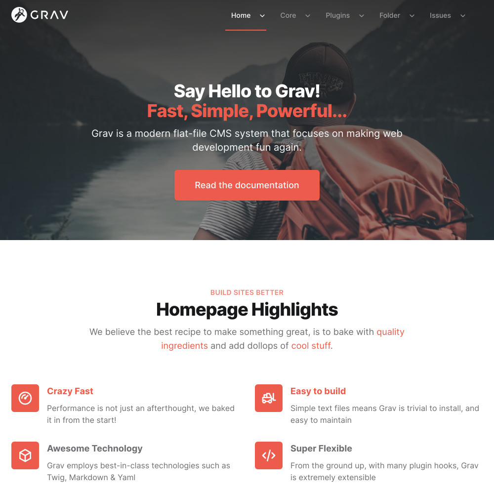

# Typhoon One-Page Skeleton

This skeleton serves as a basic content skeleton for demonstrating a simple **one-page site** with the [Typhoon Grav Premium Theme](https://getgrav.org/premium/typhoon).



## Installation

1. Download latest Grav package.  Either [Grav 1.6](https://getgrav.org/download/core/grav/latest) or [Grav 1.7RC](https://getgrav.org/download/core/grav/latest?testing)

2. Unzip the `grav-v*.zip` file.

3. Download and unzip the `grav-skeleton-typhoon-onepage.zip` Skeleton package and unzip it.

4. Replace the default `user/` folder with this skeleton's extracted folder, and rename it to `user/`

5. Launch a terminal window and navigate to the root of your Grav installation

6. Confirm you can run CLI commands by typing `bin/gpm version`.  It should output the current version of Grav you are running.

7. Install the `license-manager` plugin with the command:

    ```shell
    bin/gpm install license-manager
    ```

8. If you want to continue the process via the admin manager, install that via:

    ```shell
    bin/gpm install admin
    ```

9. When you purchased Typhoon you should of received an email with a link to the license page on getgrav.org.  Visit that page and download the `licences.yaml` file.

10. On your machine copy the `licenses.yaml` to the `user/data` folder.  This will allow you to install `typhoon` theme, as well as `svg-icons` and `lightbox-gallery` plugins.

11. For **Typhoon One-Page** skeleton run this command to install all the themes + plugins:

    ```shell
    bin/gpm install error markdown-notices form problems typhoon color-tools lightbox-gallery shortcode-core svg-icons
    ```

Your site should have everything it needs to replicate the **Typhoon One-Page** skeleton site.  Please compare your local copy to the [Typhoon One-Page Demo Site](https://demo.getgrav.org/typhoon/onepage).
